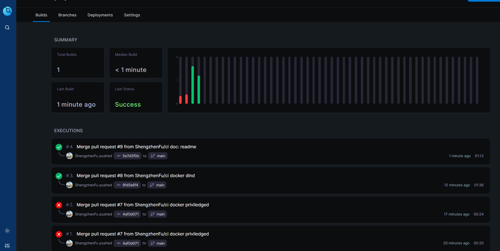
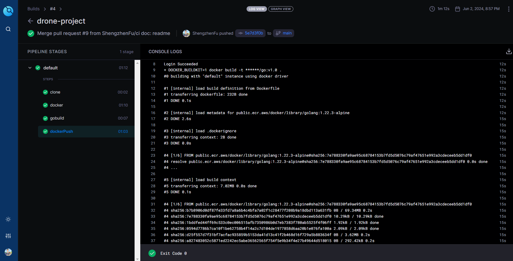
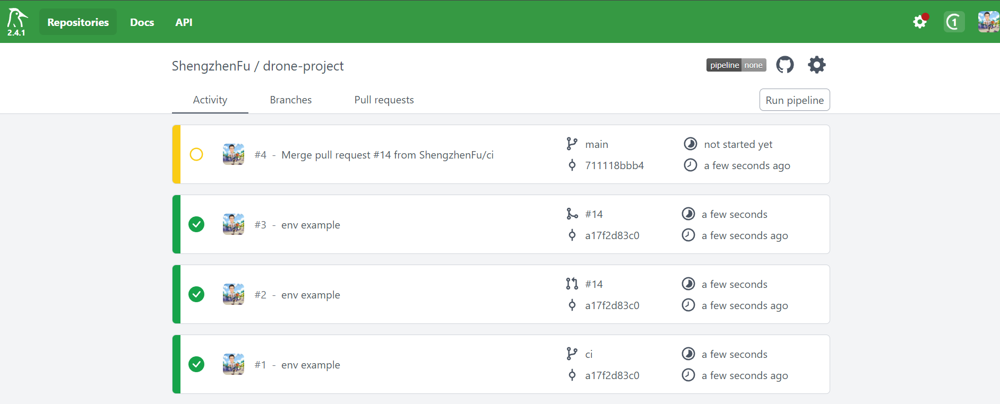

# A drone ci project
code structure

- woodpecker-installation: for woodpecker installation
- .woodpecker.yaml       : define the pipeline

- drone-installation     : i use this to install drone-ci via docker compose
- .drone.yml             : define the pipeline

- src                    : a simple Golang program, for go build, go test and docker build

**Drone Dashboard**

**Drone Pipeline**

**Woodpecker Dashboard**

**Woodpecker Pipeline**

